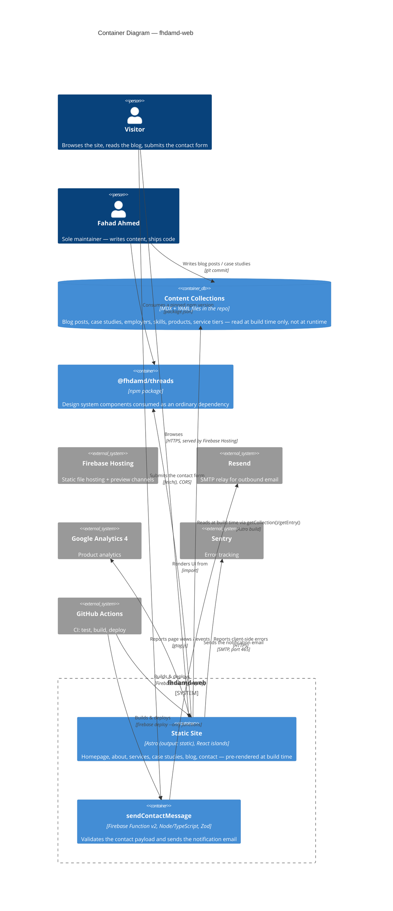
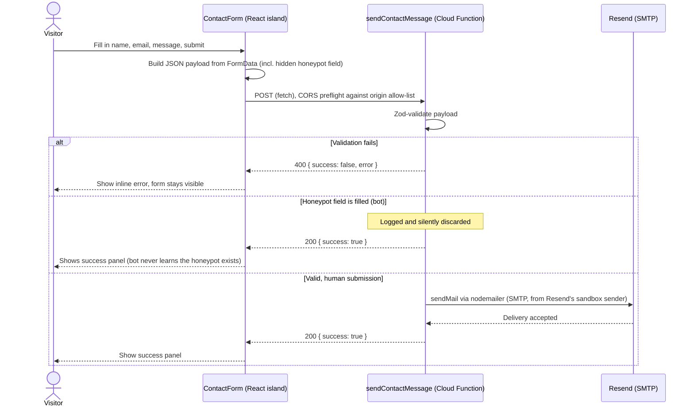
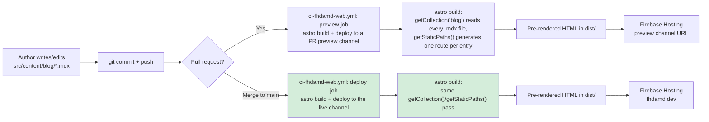
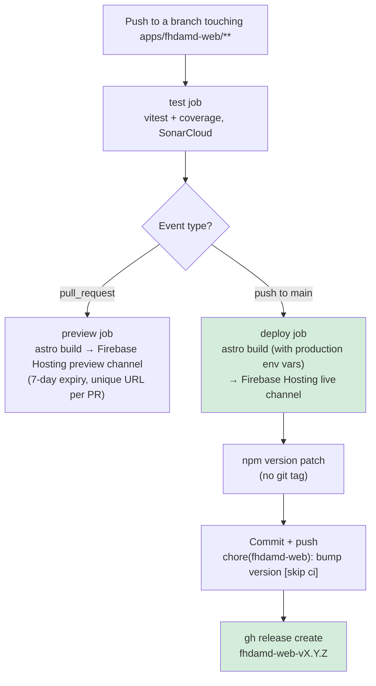

# fhdamd-web Solution Architecture Document

**Product:** fhdamd-web (personal site) \
**Organisation:** fhdamd \
**Repository:** fhdamd-org (Monorepo) \
**Author:** Fahad Ahmed \
**Status:** Draft \
**Last Updated:** 05 Sep 2026

## 1. Purpose & Scope

### 1.1 Purpose

This document describes the solution architecture of fhdamd-web, following the template established by [sad-pdfcraft.md](sad-pdfcraft.md). It is deliberately shorter — fhdamd-web has no authentication, no payments, no database, and a single backend endpoint — and skips or compresses sections that don't apply rather than padding them out.

### 1.2 In Scope

- The **overall system architecture**: a static Astro site plus one Firebase Cloud Function.
- The **content architecture**: Astro Content Collections as the content model, and why it replaced DatoCMS for this specific site.
- The **contact form flow**: the one piece of genuine backend behaviour this site has.
- **Deployment**: PR preview channels and continuous production deployment on merge to `main`.
- **Observability**: GA4 and Sentry instrumentation.

### 1.3 Out of Scope

Same categories as [sad-pdfcraft.md §1.3](sad-pdfcraft.md#13-out-of-scope): UI/UX and design system implementation details (see `@fhdamd/threads`'s own documentation and Storybook), feature-level content/copy, low-level code structure, and Firebase/GCP platform internals.

## 2. Architectural Principles

Inherits the organisation-wide principles in [solution-architecture.md §7](solution-architecture.md#7-architectural-principles). The one worth calling out specifically for this product:

- **Static by default, server only where a real backend concern exists.** Unlike pdf-craft (`output: 'server'`, SSR throughout), fhdamd-web is `output: 'static'` (`astro.config.mjs`). The one place that needs real server-side behaviour — sending an email — is pulled out into its own small Cloud Function rather than becoming a reason to run the whole site as a server. See [ADR-002](#adr-002-a-standalone-cloud-function-for-the-contact-form-not-server-output).

## 3. Architectural Decisions (ADRs)

### ADR-001: Astro Content Collections over a headless CMS

**Decision:** Content lives in Astro Content Collections (`src/content.config.ts`) — MDX files for long-form content (blog, case studies) and YAML files for structured lists (employers, skills, products, service tiers) — rather than DatoCMS, which this site used earlier in its build.

**Why:** A headless CMS earns its cost when a non-technical collaborator needs to publish content without a developer in the loop. fhdamd-web has exactly one maintainer, who is a developer and is comfortable in a text editor. Content Collections keep content in git (reviewed in the same PR as any related code change, no webhook or API round-trip to stay in sync, no external account to manage) with none of the downside DatoCMS exists to solve, because there's no non-technical publisher it would be solving it for. DatoCMS remains the right tool for [pdf-craft](sad-pdfcraft.md) and for client builds like the RZest case study, where that constraint genuinely exists.

**Trade-offs:** Every content change requires a git commit and a deploy — there's no live-editing-without-a-deploy capability a CMS would provide. Acceptable here; would not be for a client who needs to self-publish.

### ADR-002: A standalone Cloud Function for the contact form, not server output

**Decision:** The contact form posts to a dedicated Firebase Function (`sendContactMessage`, in `apps/fhdamd-web/functions/`) via a plain `fetch()` call, rather than switching the site to `output: 'server'`/`'hybrid'` and handling it with an Astro Action or server endpoint.

**Why:** Adding server output for one form would move the entire site off pure static hosting — every page would need a server runtime available, even though only one interaction needs one. A standalone HTTP function keeps the other 90% of the site fully static (cheaper to host, nothing to keep warm, no server-side rendering to reason about) while giving the one feature that needs a backend exactly that, independently deployable and scaled.

**Trade-offs:** Two separate build/deploy units for one app (the Astro site and the Functions codebase), each with its own `package.json`, instead of one. CORS has to be handled explicitly (`cors` npm package, an explicit origin allow-list) since the function is called cross-origin from the static site's domain — a concern that wouldn't exist with a same-origin server endpoint.

### ADR-003: `defineSecret` for all three contact-function config values, not just the API key

**Decision:** `RESEND_API_KEY`, `CONTACT_TO_ADDRESS`, and `CONTACT_FROM_ADDRESS` are all declared via `defineSecret` (Firebase Secret Manager), even though the latter two aren't sensitive.

**Why:** An earlier version used `defineString` (Firebase's non-secret runtime-parameter mechanism) for the two plain values, which required committing a `functions/.env` file to supply them for non-interactive deploys. That read, at a glance, exactly like a committed secret — a reasonable thing to flag in review even though the actual values weren't sensitive. Matching pdf-craft's own precedent (`APP_BASE_URL` is a non-secret value declared via `defineSecret` there too — see [sad-pdfcraft.md ADR-002](sad-pdfcraft.md#adr-002-firebase-functions-for-asynchronous-event-driven-and-scheduled-work)) avoids the ambiguity entirely: nothing configuration-shaped lives in a file in the repo at all.

**Trade-offs:** Changing a non-secret value (e.g. the reply-to display name) requires a `gcloud`/`firebase functions:secrets:set` call rather than a one-line file edit and commit — a minor loss of visibility/history for values that would otherwise be plainly readable in git.

### ADR-004: Resend's shared sandbox sender over full domain verification

**Decision:** Outbound mail from the contact form uses Resend's shared `onboarding@resend.dev` sender rather than a `fhdamd.dev`-verified sending domain.

**Why:** Resend's unverified-domain restriction — a sandbox sender may only deliver to the Resend account's own registered email address — is a non-issue here, because this function has exactly one recipient, ever: the site owner's own inbox, which is that same registered address. Domain verification would add DNS work (SPF/DKIM records) for zero functional benefit given the single-recipient use case.

**Trade-offs:** The visitor's inbox sees a `resend.dev` sender address rather than a `fhdamd.dev` one — less polished, though `replyTo` is still set to the visitor's own address, so replying works normally. This stops being a valid trade-off the moment the function ever needs to send to more than one fixed address.

### ADR-005: Explicit CORS origin allow-list, not a wildcard

**Decision:** `sendContactMessage` restricts callers to an explicit allow-list — `http://localhost:4321`, `https://fhdamd.dev`, and a regex matching Firebase preview-channel URLs (`*.web.app` / `*.firebaseapp.com`) — rather than `cors()`'s permissive default or a blanket `*`.

**Why:** The function genuinely needs to be callable from more than one origin — production, local dev, and every PR's dynamically-named preview channel — so a single hardcoded origin string isn't enough. But the function also shouldn't be callable from an arbitrary third-party site embedding a request to it. A pattern-matched allow-list satisfies both: legitimate origins (including ones whose exact hostname isn't known in advance, like a PR preview) pass; everything else is rejected at the CORS layer before validation even runs.

**Trade-offs:** The preview-channel regex is coupled to Firebase Hosting's current URL format; if that format ever changes, or a custom preview domain is introduced, the allow-list needs a corresponding update. This is a manually-maintained security boundary, not a platform-enforced one.

### ADR-006: Analytics and error tracking deliberately unset outside production

**Decision:** `PUBLIC_GA_MEASUREMENT_ID` and `PUBLIC_SENTRY_DSN` are only ever set in the production build's CI environment (`ci-fhdamd-web.yml`'s `deploy` job) — local dev and every PR preview build run with both unset.

**Why:** GA4 and Sentry both no-op cleanly when their respective ID/DSN is absent (`Layout.astro`'s conditional script injection; `Sentry.init()` accepts an undefined DSN as a deliberate no-op). Leaving them set in preview builds would mean every PR review, every local `pnpm dev` session, and every test click contaminates production analytics and error-tracking data with non-representative traffic — undermining the very data those tools exist to produce.

**Trade-offs:** GA4/Sentry wiring itself can only be verified against a real production deploy, not in a PR preview — a regression in the tracking snippet itself wouldn't surface until after merge. Accepted as a reasonable trade against permanently degraded production data quality.

## 4. Technical Components

- Astro (static output)
- React (islands only — contact form, blog tag filter, table of contents, copy-link button)
- `@fhdamd/threads` (design system, npm-published)
- Firebase Hosting (static site) + Firebase Functions v2 (contact form)
- Resend (transactional email, via nodemailer/SMTP)
- Google Analytics 4
- Sentry (client-side)
- `@astrojs/sitemap`

## 5. Conceptual Architecture

fhdamd-web is a statically-generated Astro site — every page is pre-rendered HTML at build time, with a small number of React islands hydrated client-side for the handful of genuinely interactive pieces. The only runtime backend call the site makes is the contact form's `fetch()` to its own Cloud Function; everything else a visitor sees is served as static files from Firebase Hosting with no server in the request path.

### C4 — Container Diagram

## 6. Sequence & Flow Diagrams

### 6.1 Contact Form Submission

> The honeypot path returning the *same* success response as a real submission is deliberate — a bot that receives a 400 or a distinct response learns to stop filling that field.

### 6.2 Content Build & Deploy Pipeline

Blog posts and case studies are just files in the repo — there is no live publish step at runtime. Content changes only take effect through the same build-and-deploy pipeline as a code change:

> A post is only reachable at `/blog/<slug>` once `getStaticPaths()` has generated that route at build time — there's no way to view a post that hasn't been through a build. `getHomePage()` and `getBlogPage()` (`src/lib/content/index.ts`) independently query the same `blog` collection to build the homepage's "From the blog" teaser and the full blog listing, respectively — both are read-only views over the same underlying files, not separate content stores.

### 6.3 Deploy Pipeline — CI Jobs

> Unlike pdf-craft, there is no staging environment, no manual approval gate, and no E2E suite gating production — every merge to `main` deploys directly to `fhdamd.dev`. See [§8](#8-known-gaps) for why this is an acceptable trade for this product specifically.

## 7. Content Architecture

Content is split along one line: **does this content repeat, or is it page-level singleton copy?**

- **Singleton page copy** (hero headings, CTA text, section intros) lives as plain TypeScript objects in `src/content/site/*.ts` — one file per page (`homePage.ts`, `aboutPage.ts`, `contactPage.ts`, ...). These aren't Content Collections; they're just typed data, imported directly.
- **Repeating content** lives in Astro Content Collections (`src/content.config.ts`), each collection backed by either:
  - `glob` loader over MDX files, for long-form content with a real body: `blog`, `caseStudies`.
  - `file` loader over a single YAML file, for structured lists with no prose body: `employers`, `clientWork`, `experience`, `skills`, `products`, `serviceOfferings`, `serviceAddons`, `deliveryPhases`.

A thin data-access layer (`src/lib/content/index.ts`) is the only consumer of `getCollection()`/`getEntry()` — one `get*Page()` function per page, each merging the relevant singleton copy with whatever collection data that page needs, already sorted/filtered/shaped into exactly what the page template expects. Pages never call the Content Collections API directly, which keeps sorting/filtering logic (e.g. "3 most recent blog posts," "case studies sorted by an explicit `order` field because YAML array order isn't preserved by `getCollection()`") in one place instead of duplicated per page.

## 8. Deployment Plan

### 8.1 Environments

Unlike pdf-craft's three-tier DEV/STG/PRD split, fhdamd-web has effectively two: **PR previews** (ephemeral, one per open PR) and **production** (`fhdamd.dev`, continuously deployed from `main`). There is no persistent staging environment.

| Environment | Trigger | Firebase project | Notes |
|---|---|---|---|
| **Preview** | Any PR touching `apps/fhdamd-web/**` | `fahad-web` (Hosting preview channel) | Unique URL per PR, 7-day expiry, `PUBLIC_GA_MEASUREMENT_ID`/`PUBLIC_SENTRY_DSN` deliberately left unset so preview traffic doesn't pollute production analytics/error data |
| **Production** | Push to `main` | `fahad-web` (Hosting live channel) | `fhdamd.dev`; also deploys the `sendContactMessage` function |

### 8.2 Why No Staging Tier, No E2E Gate

pdf-craft's RC → staging → E2E gate → manual approval → production pipeline exists because a regression there has real user-facing or financial consequences (accounts, credits, Stripe). fhdamd-web is a brochure site with no user data and one low-stakes backend interaction (an email send); the cost of that pipeline's overhead isn't justified by what it would be protecting. Continuous deployment from `main`, backed by the `test` job's Vitest suite and SonarCloud scan running on every push, is judged sufficient for this product's actual risk profile — see [solution-architecture.md §8](solution-architecture.md#8-known-gaps--forward-looking-items) for the org-level note that this pattern is pdf-craft-specific today.

### 8.3 Versioning

fhdamd-web's own `package.json` version is bumped automatically (`npm version patch`) by the `deploy` job on every merge to `main`, tagged as a GitHub Release (`fhdamd-web-vX.Y.Z`) — a simple monotonic counter with no semantic meaning, purely to mark "this commit was deployed." This is a different model from `@fhdamd/threads`, which uses [Release Please](https://github.com/googleapis/release-please) and Conventional Commits because it's an independently-published, independently-consumed npm package where semantic versioning carries real meaning for downstream consumers (see [solution-architecture.md §5](solution-architecture.md#5-shared-platform-decisions)).

fhdamd-web **consumes** `@fhdamd/threads` as an ordinary pinned dependency (`^0.6.0` in `package.json`, not `workspace:*`), bumped deliberately — typically alongside a feature/fix that needs the new version — rather than automatically tracking threads' latest release. This is the same intentional-lag pattern pdf-craft follows for the same reason: bumping a shared design-system dependency is a real (if usually small) risk surface, worth doing with intent rather than on autopilot.

## 9. Observability

- **Product analytics:** Google Analytics 4, via `gtag.js`, loaded only when `PUBLIC_GA_MEASUREMENT_ID` is set — deliberately unset in local dev and PR previews so that traffic from either doesn't pollute production analytics.
- **Error tracking:** Sentry (`@sentry/astro`), client-side only (`sentry.client.config.ts` — there's no server-side config, since a fully static site has no server runtime to instrument), initialised via `PUBLIC_SENTRY_DSN` — same unset-in-dev/preview pattern as GA4. Source maps are uploaded at build time (`org: 'fhdamd'`, `project: 'fhdamd-web'`) when `SENTRY_AUTH_TOKEN` is available (production builds only).
- **Contact function logging:** `sendContactMessage` uses `firebase-functions/logger` for structured logs (send success, send failure, honeypot triggers) — visible via `firebase functions:log` or Cloud Logging directly. No Sentry instrumentation in the Functions codebase yet (unlike pdf-craft's Functions, which do initialise `@sentry/node` — see [sad-pdfcraft.md ADR-007](sad-pdfcraft.md#adr-007-direct-sentrynode-initialisation-over-serverless-wrapper-integrations-in-functions)).

## 10. Known Gaps

Documented honestly so the record stays accurate:

- **No staging environment or E2E suite** — see [§8.2](#82-why-no-staging-tier-no-e2e-gate) for why this is judged an acceptable trade today; would need revisiting if the site ever grows a feature with real user-facing or data-integrity risk.
- **No rate limiting on the contact form** — only a honeypot field guards against spam. Acceptable at current traffic; a determined spammer could still hit the endpoint directly. Full reCAPTCHA was deliberately deferred (see the form's own scope decisions) to avoid stacking another external credential on top of GA4/Sentry/Resend for a low-traffic personal form.
- **No Sentry instrumentation in the Functions codebase** — errors are only visible via structured logs/Cloud Logging, not Sentry, unlike pdf-craft's Functions.
- **No automated tests for the `functions/` package** — the Astro app has a Vitest suite (including `ContactForm.tsx`'s success/error/validation paths, mocking `fetch`), but `sendContactMessage` itself has no unit or integration test coverage; it was verified manually (curl + a live end-to-end browser run) at build time rather than covered by an automated suite.

## Appendix

- [Root README](../README.md) — workspace layout, getting started
- [fhdamd-web README](../apps/fhdamd-web/README.md) — day-to-day commands, content model summary
- [Org-level Solution Architecture](solution-architecture.md)
- [PDF-Craft Solution Architecture Document](sad-pdfcraft.md) — the more mature sibling document this one follows the template of
