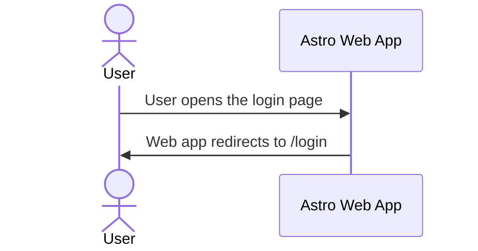

# PDF-Craft Solution Architecture Document

**Product:** PDF-Craft \
**Organisation:** fhdamd \
**Repository:** fhdamd-org (Monorepo) \
**Author:** Fahad Ahmed \
**Status:** Draft \
**Last Updated:** 21 Dec 2025

## 1. Purpose & Scope

### 1.1 Purpose

### 1.2 In Scope

### 1.3 Out of Scope

## 2. Architectural Principles

- Serverless First
- Security by Default - Zero-trust access, signed URLs, least privilege IAM
- Monorepo Parity - DEV, STG, PRD behave identically
- Cost Aware Design

## 3. Architectural Decisions (ADRs)

## 4. Technical Components

- Astro Frontend
- React
- Firebase
- Stripe
- Resend
- Sentry
- Turborepo
- Github
- Terraform

## 5. Conceptual Architecture

## 6. Sequence Diagrams

### 6.1 High Level Flow

### 6.2 Stripe Payment Flow

### 6.3 Daily Cron Job

## 7. Data Architecture

## 8. Storage Architecture

## 9. Security

## 10. Observability

## 11. Deployment Plan

### 11.1 Environments

### 11.2 Release Strategy

### 11.3 Semantic Versioning

## Appendix

- How to update environment variables and secrets in Google Secrets Manager
