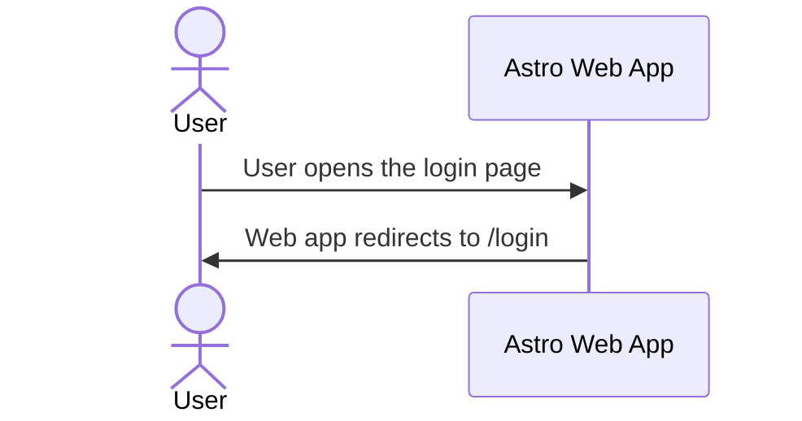

# PDF-Craft Solution Architecture Document

**Product:** PDF-Craft \
**Organisation:** fhdamd \
**Repository:** fhdamd-org (Monorepo) \
**Author:** Fahad Ahmed \
**Status:** Draft \
**Last Updated:** 21 Dec 2025

## 1. Purpose & Scope

### 1.1 Purpose

This document describes the solution architecture of PDF-Craft.
It captures the system architecture, key architectural decisions, and operational assumptions made during the initial design and implementation.

The primary audience is future maintainers and architects of PDF-Craft(including the original author). The document prioritises clarity of intent and decision rationale over exhaustive detail.

### 1.2 In Scope

This document covers the **solution-level architecture** of the PDF-Craft platform. Specifically, it includes:

- The **overall system architecture**, including the interaction between the Astro Web application, Astro Actions, Firebase services and third-party providers.
- The **frontend architecture** of the Astro + React web application focusing on the responsibilities and trust boundaries rather than UI implementation details.
- The **backend execution model**, including:
  - Use of Astro Actions as the primary server-side API layer.
  - Use of Firebase Functions for asynchronous, long-running, and event-driven worklaods.
- **Authentication and Authorization architecture**, including Firebase Authentication and access control decisions.
- **PDF processing flows**, including orchestration, background execution, idempotency expectations, and lifecycle management.
- **Data architecture**, covering Firebase data models, ownership boundaries, and state transitions.
- **Storage architecture**, including Firebase storage bucket separation, signed URL access patterns, and data retention policies.
- **Payment and billing integration**, including Stripe Checkout flows, webhook processing, and entitlement updates.
- **Transactional email architecture**, including event triggers, delivery flow via third-party providers, failure handling, and observability.
- **Operational architecture**, including:
  - Environment separation (DEV, STG, PRD)
  - Deployment and release strategy
  - Scheduled background jobs and cleanup tasks
- **Security architecture**, including trust boundaries, abuse prevention mechanisms, and secrets management.
- **Observability and operational concerns**, such as logging, error tracking, and monitoring expectations.
- **Architectural decisions and trade-offs**, either documented directly in this document or referenced via Architecture Decision Records (ADRs).

### 1.3 Out of Scope

This document intentionally exclude the following areas:

- **UI/UX and visual design**, including styling, layout, and design system implementation details.
- **Feature-level behaviour**, such as detailed descriptions of individual PDF operations, validation rules, and pricing logic.
- **Low-level implementation details**, including application code structure, framework-specific patterns, and configuration syntax.
- **Platform internals**, including Firebase- and GCP-managed service implementations and runtime internals.
- **Operational processes**, such as customer support workflows, incident response procedures, and manual administrative tasks.
- **Non-target platforms**, including native mobile apps, desktop applications, browser extensions, and unsupported third-party integrations.
- **End-user and business documentation**, including marketing content, legal documents, and user guides.

> Topics excluded here may be documented separately in ADRs, runbooks, or product documentation where appropriate.

## 2. Architectural Principles

- Serverless First
- Security by Default - Zero-trust access, signed URLs, least privilege IAM
- Monorepo Parity - DEV, STG, PRD behave identically
- Cost Aware Design

## 3. Architectural Decisions (ADRs)

## 4. Technical Components

- Astro Frontend
- React
- Firebase
- Stripe
- Resend
- Sentry
- Turborepo
- Github
- Terraform

## 5. Conceptual Architecture

## 6. Sequence Diagrams

### 6.1 High Level Flow

### 6.2 Stripe Payment Flow

### 6.3 Daily Cron Job

### 6.4 Transactional Email Delivery

## 7. Data Architecture

## 8. Storage Architecture

## 9. Security

## 10. Observability

## 11. Deployment Plan

### 11.1 Environments

### 11.2 Release Strategy

### 11.3 Semantic Versioning

## Appendix

- How to update environment variables and secrets in Google Secrets Manager
