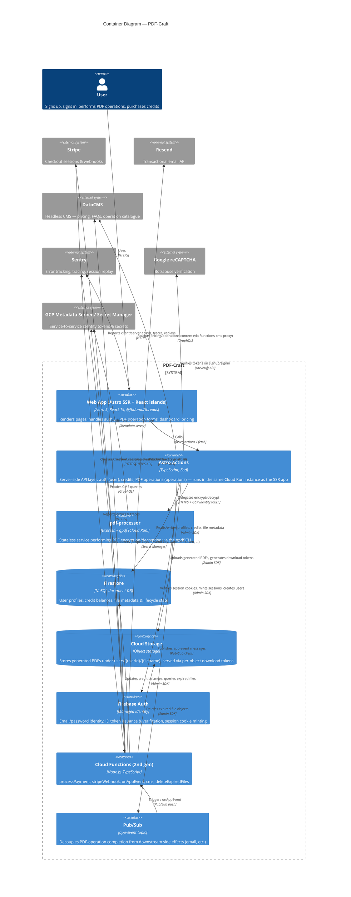
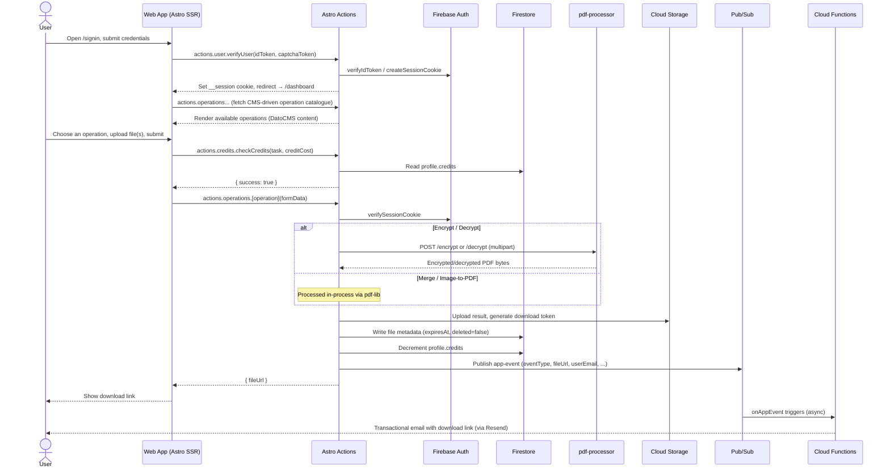
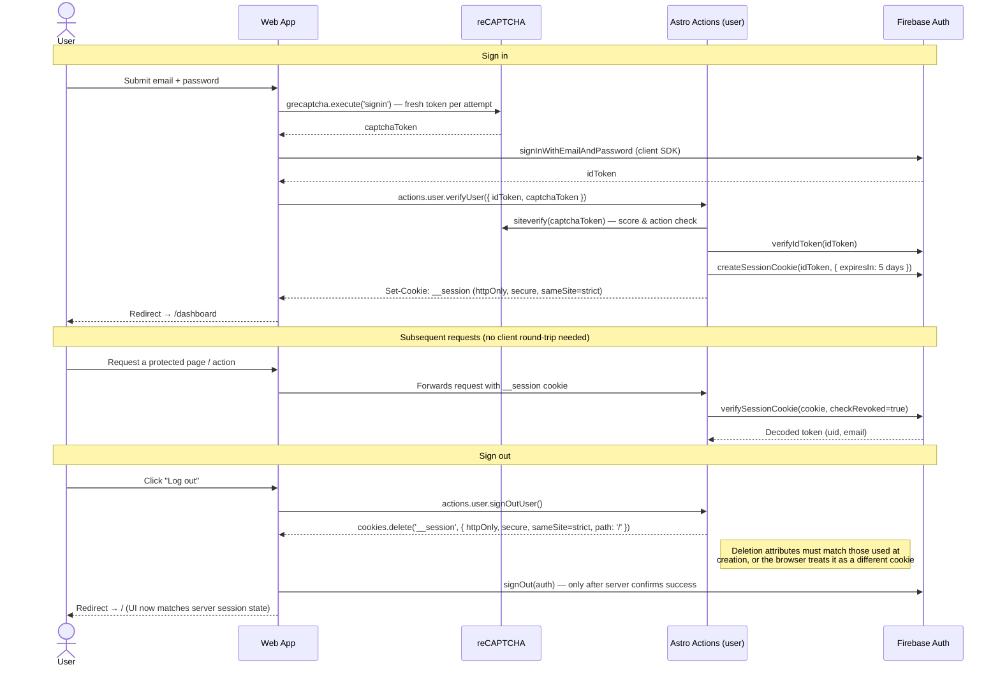
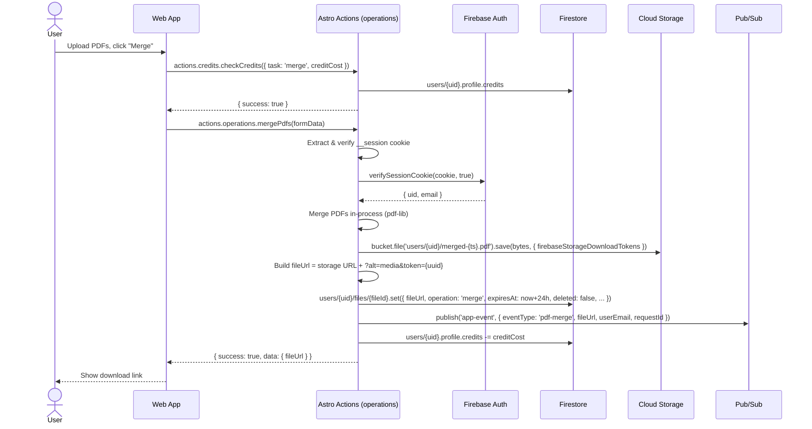
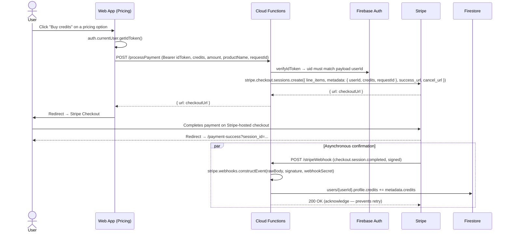
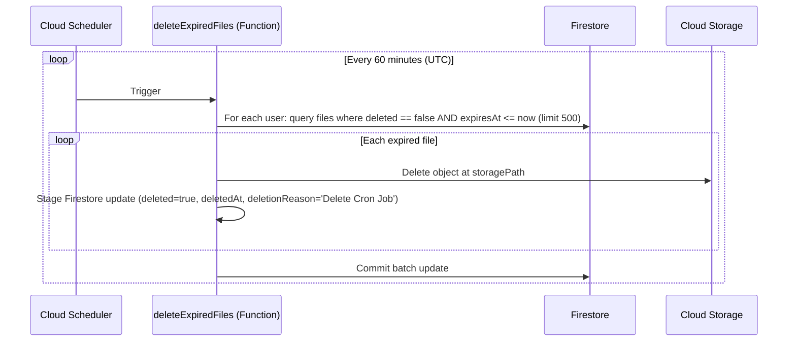
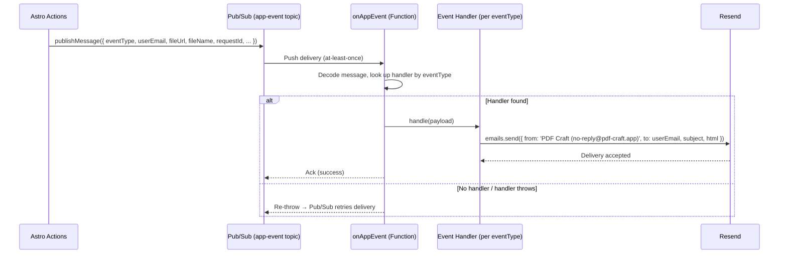

# PDF-Craft Solution Architecture Document

**Product:** PDF-Craft \
**Organisation:** fhdamd \
**Repository:** fhdamd-org (Monorepo) \
**Author:** Fahad Ahmed \
**Status:** Draft \
**Last Updated:** 08 Jun 2026

## 1. Purpose & Scope

### 1.1 Purpose

This document describes the solution architecture of PDF-Craft.
It captures the system architecture, key architectural decisions, and operational assumptions made during the initial design and implementation.

The primary audience is future maintainers and architects of PDF-Craft (including the original author). The document prioritises clarity of intent and decision rationale over exhaustive detail.

### 1.2 In Scope

This document covers the **solution-level architecture** of the PDF-Craft platform. Specifically, it includes:

- The **overall system architecture**, including the interaction between the Astro Web application, Astro Actions, Firebase services and third-party providers.
- The **frontend architecture** of the Astro + React web application focusing on the responsibilities and trust boundaries rather than UI implementation details.
- The **backend execution model**, including:
  - Use of Astro Actions as the primary server-side API layer.
  - Use of Firebase Functions for asynchronous, long-running, and event-driven workloads.
- **Authentication and Authorization architecture**, including Firebase Authentication and access control decisions.
- **PDF processing flows**, including orchestration, background execution, idempotency expectations, and lifecycle management.
- **Data architecture**, covering Firebase data models, ownership boundaries, and state transitions.
- **Storage architecture**, including Firebase storage bucket separation, signed URL access patterns, and data retention policies.
- **Payment and billing integration**, including Stripe Checkout flows, webhook processing, and entitlement updates.
- **Transactional email architecture**, including event triggers, delivery flow via third-party providers, failure handling, and observability.
- **Operational architecture**, including:
  - Environment separation (DEV, STG, PRD)
  - Deployment and release strategy
  - Scheduled background jobs and cleanup tasks
- **Security architecture**, including trust boundaries, abuse prevention mechanisms, and secrets management.
- **Observability and operational concerns**, such as logging, error tracking, and monitoring expectations.
- **Architectural decisions and trade-offs**, either documented directly in this document or referenced via Architecture Decision Records (ADRs).

### 1.3 Out of Scope

This document intentionally excludes the following areas:

- **UI/UX and visual design**, including styling, layout, and design system implementation details.
- **Feature-level behaviour**, such as detailed descriptions of individual PDF operations, validation rules, and pricing logic.
- **Low-level implementation details**, including application code structure, framework-specific patterns, and configuration syntax.
- **Platform internals**, including Firebase- and GCP-managed service implementations and runtime internals.
- **Operational processes**, such as customer support workflows, incident response procedures, and manual administrative tasks.
- **Non-target platforms**, including native mobile apps, desktop applications, browser extensions, and unsupported third-party integrations.
- **End-user and business documentation**, including marketing content, legal documents, and user guides.

> Topics excluded here may be documented separately in ADRs, runbooks, or product documentation where appropriate.

## 2. Architectural Principles

- **Serverless First** — managed, auto-scaling compute (App Hosting / Cloud Run / Cloud Functions) over self-managed infrastructure.
- **Security by Default** — zero-trust access, signed URLs, least privilege IAM.
- **Monorepo Parity** — DEV, STG, PRD behave identically.
- **Cost Aware Design** — scale-to-zero, retention/cleanup jobs for ephemeral data, batched background work.

These principles are shared across the wider organisation — see [solution-architecture.md §7](solution-architecture.md#7-architectural-principles).

## 3. Architectural Decisions (ADRs)

These are the significant, durable decisions behind PDF-Craft's design. Each is recorded as a lightweight ADR: the decision, why it was made, and what it costs.

### ADR-001: Astro Actions as the primary server-side API layer

**Decision:** Use [Astro Actions](https://docs.astro.build/en/guides/actions/) (`src/actions/*`) as the primary mechanism for browser → server calls (auth, credits, PDF operations), rather than standalone REST endpoints or a separate API service.

**Why:** Astro Actions are colocated with the frontend, type-safe end-to-end (the client gets typed `actions.*` calls derived from the server-side `defineAction` schemas), and run in the same SSR runtime — no separate deployment, routing, or CORS concerns for first-party calls.

**Trade-offs:** Action bodies are capped by `security.actionBodySizeLimit` (Astro default: 1 MB — too small for multi-file PDF uploads; PDF-Craft raises this explicitly in `astro.config.mjs`). Actions also run inside the same Cloud Run instance as page rendering, so CPU-heavy work should be delegated elsewhere (see ADR-003).

### ADR-002: Firebase Functions for asynchronous, event-driven, and scheduled work

**Decision:** Use Firebase Functions (2nd gen, in `functions/`) for work that doesn't belong in the synchronous request/response cycle: Stripe payment processing and webhooks, Pub/Sub-driven side effects (`onAppEvent`), the CMS proxy, and the scheduled cleanup job.

**Why:** This work is either long-running, needs to survive retries (Pub/Sub, Stripe webhooks), needs to run on a schedule independent of user traffic, or needs elevated trust (service-to-service auth, secrets) that shouldn't sit in the page-rendering path.

**Trade-offs:** Two backend runtimes (Astro SSR + Functions) means two places to manage secrets, logging, and observability — mitigated by mirroring the structured-logging and Sentry setup between `src/utils/lib/logger.ts` and `functions/src/utils/logger.ts`.

### ADR-003: A dedicated `pdf-processor` microservice for CPU-bound, native-dependency operations

**Decision:** Encrypt and decrypt operations are delegated over HTTP to `apps/pdf-processor`, a small stateless Express service running on Cloud Run that shells out to the `qpdf` CLI. Merge and image-to-PDF operations, by contrast, run in-process inside the Astro Action using `pdf-lib` (a pure-JS library).

**Why:** `qpdf` is a native binary dependency that cannot run inside the Astro App Hosting / Cloud Run container alongside the web app, and PDF encryption/decryption is CPU-bound work that shouldn't block the request-handling runtime serving every other user. A separate, independently scalable Cloud Run service isolates this dependency and workload.

**Trade-offs:** An extra network hop, an extra service to deploy/monitor, and a service-to-service authentication concern (solved via GCP metadata-server identity tokens in production — see [§9](#9-security)). `pdf-processor` exists solely to serve `pdf-craft` and has no independent lifecycle today.

### ADR-004: Signed download tokens over Storage Security Rules for file access

**Decision:** Firebase Storage rules deny all client access (`allow read, write: if false`). Files are instead served via per-object `firebaseStorageDownloadTokens`, embedded in a signed-style download URL (`...?alt=media&token=<uuid>`) generated at upload time and stored in the corresponding Firestore document.

**Why:** This avoids needing to express "a user may read only their own files" in Storage Security Rules (which historically had limitations expressing per-document ownership cleanly against Storage paths) and keeps all file-serving logic server-side and auditable.

**Trade-offs (flagged as a known gap, see [§9](#9-security)):** A leaked token grants access to that object indefinitely (tokens don't expire on their own — only the cleanup job's deletion of the underlying object ends access). This is materially different from short-lived signed URLs and should be revisited — e.g. by issuing time-boxed signed URLs via the Admin SDK (`file.getSignedUrl()`) instead of static download tokens.

### ADR-005: Server-side session cookies (`__session`) over client-held ID tokens

**Decision:** After Firebase client-side sign-in, the ID token is exchanged for a server-managed session cookie (`auth.createSessionCookie`, 5-day expiry, `httpOnly`, `secure` in production, `sameSite=strict`), stored under the reserved `__session` cookie name (recognised by Firebase Hosting / App Hosting).

**Why:** This lets Astro's SSR pages and Actions authenticate the user from the request itself (`context.request.headers.get('cookie')` → `auth.verifySessionCookie`) without round-tripping to the client for a fresh ID token on every request, and keeps the credential out of reach of client-side JavaScript (`httpOnly`).

**Trade-offs:** Logout requires a server round-trip to clear the cookie (the client cannot delete an `httpOnly` cookie itself) — the client and server must agree on success before the UI reflects "logged out", otherwise the two can drift out of sync (a real defect that was identified and fixed; see the cookie-deletion attributes and the success-gating in `src/components/ui/Header/Header.tsx` and `src/actions/user.ts`).

### ADR-006: Explicit `PUBLIC_APP_ENV` for observability environment tagging

**Decision:** Sentry's `environment` is driven by an explicit `PUBLIC_APP_ENV` variable (`dev` / `stg` / `prod`), set per Firebase backend via Secret Manager (`apphosting.yaml` → `secret: appEnv`) and per-Functions deployment via `.env.<project-id>` files — rather than inferred from `NODE_ENV` or hostname.

**Why:** `NODE_ENV` is a build/runtime concern (`production` vs `development`) that doesn't map cleanly onto *deployment* environments (you can run a `production` build against a staging backend). Hostname parsing is fragile and breaks under custom domains, previews, or local proxying. An explicit, independently-configured variable keeps the two concerns separate and makes the mapping visible in configuration rather than inferred in code.

**Trade-offs:** One more piece of per-environment configuration to set up and keep in sync (tracked as a deployment task — see [§11](#11-deployment-plan)).

### ADR-007: Direct `@sentry/node` initialisation over serverless wrapper integrations in Functions

**Decision:** Firebase Functions initialise Sentry directly (`Sentry.init(...)` + `Sentry.captureException(...)`) rather than using `@sentry/google-cloud-serverless`'s function-wrapping helpers.

**Why:** Firebase Functions v2 (`onRequest`, `onMessagePublished`, `onSchedule`) already provides its own function-wrapping and lifecycle management; stacking a second wrapping layer on top risked subtle conflicts (double-reporting, context loss, or interference with Firebase's own retry/ack semantics) for marginal benefit. Direct initialisation plus a logger-level hook (`log.exception` → `Sentry.captureException`) gives full coverage with a simpler mental model.

## 4. Technical Components

- Astro Frontend
- React
- Firebase
- Stripe
- Resend
- Sentry
- Turborepo
- Github
- Terraform

## 5. Conceptual Architecture

PDF-Craft is a server-rendered Astro application with React islands for interactivity, backed by Firebase as its primary platform (Auth, Firestore, Storage, Functions, Pub/Sub) and a small set of focused third-party integrations (Stripe for payments, Resend for email, DatoCMS for editable content, Sentry for observability, reCAPTCHA for abuse prevention).

The system separates concerns along two axes:

1. **Synchronous vs. asynchronous** — user-facing requests (auth, credit checks, PDF operations) are handled synchronously by Astro Actions within the request/response cycle; everything that can happen *after* the user has what they need (emails, credit reconciliation from payment webhooks, cleanup) is pushed onto Pub/Sub or scheduled Functions.
2. **General-purpose vs. specialised compute** — pure-JS, in-process work (merge, image-to-PDF via `pdf-lib`) runs inside the Astro Action; CPU-bound work with native dependencies (encrypt/decrypt via `qpdf`) is delegated to the dedicated `pdf-processor` service.

### C4 — Container Diagram


```mermaid
C4Container
  title Container Diagram — PDF-Craft

  Person(user, "User", "Signs up, signs in, performs PDF operations, purchases credits")

  System_Boundary(pdfcraft, "PDF-Craft") {
    Container(spa, "Web App (Astro SSR + React islands)", "Astro 5, React 19, @fhdamd/threads", "Renders pages, handles auth UI, PDF operation forms, dashboard, pricing")
    Container(actions, "Astro Actions", "TypeScript, Zod", "Server-side API layer: auth (user), credits, PDF operations (operations) — runs in the same Cloud Run instance as the SSR app")
    Container(processor, "pdf-processor", "Express + qpdf (Cloud Run)", "Stateless service performing PDF encryption/decryption via the qpdf CLI")
    ContainerDb(firestore, "Firestore", "NoSQL document DB", "User profiles, credit balances, file metadata & lifecycle state")
    ContainerDb(storage, "Cloud Storage", "Object storage", "Stores generated PDFs under users/{userId}/{filename}, served via per-object download tokens")
    Container(authsvc, "Firebase Auth", "Managed identity", "Email/password identity, ID token issuance & verification, session cookie minting")
    Container(functions, "Cloud Functions (2nd gen)", "Node.js, TypeScript", "processPayment, stripeWebhook, onAppEvent, cms, deleteExpiredFiles")
    Container(pubsub, "Pub/Sub", "app-event topic", "Decouples PDF-operation completion from downstream side effects (email, etc.)")
  }

  System_Ext(stripe, "Stripe", "Checkout sessions & webhooks")
  System_Ext(resend, "Resend", "Transactional email API")
  System_Ext(datocms, "DatoCMS", "Headless CMS — pricing, FAQs, operation catalogue")
  System_Ext(sentry, "Sentry", "Error tracking, tracing, session replay")
  System_Ext(recaptcha, "Google reCAPTCHA", "Bot/abuse verification")
  System_Ext(gcp, "GCP Metadata Server / Secret Manager", "Service-to-service identity tokens & secrets")

  Rel(user, spa, "Uses", "HTTPS")
  Rel(spa, actions, "Calls", "astro:actions / fetch")
  Rel(actions, authsvc, "Verifies session cookies, mints sessions, creates users", "Admin SDK")
  Rel(actions, firestore, "Reads/writes profiles, credits, file metadata", "Admin SDK")
  Rel(actions, storage, "Uploads generated PDFs, generates download tokens", "Admin SDK")
  Rel(actions, processor, "Delegates encrypt/decrypt", "HTTPS + GCP identity token")
  Rel(actions, pubsub, "Publishes app-event messages", "Pub/Sub client")
  Rel(actions, datocms, "Fetches pricing/operations content (via Functions cms proxy)", "GraphQL")
  Rel(actions, recaptcha, "Verifies tokens on signup/signin", "siteverify API")
  Rel(spa, sentry, "Reports client/server errors, traces, replays", "HTTPS")

  Rel(pubsub, functions, "Triggers onAppEvent", "Pub/Sub push")
  Rel(functions, resend, "Sends transactional emails", "HTTPS API")
  Rel(functions, stripe, "Creates checkout sessions, verifies webhook signatures", "HTTPS API")
  Rel(functions, firestore, "Updates credit balances, queries expired files", "Admin SDK")
  Rel(functions, storage, "Deletes expired file objects", "Admin SDK")
  Rel(functions, datocms, "Proxies CMS queries", "GraphQL")
  Rel(functions, sentry, "Reports errors & traces", "HTTPS")
  Rel(functions, gcp, "Reads secrets (Stripe keys, Resend key, DatoCMS token, ...)", "Secret Manager")

  Rel(stripe, functions, "checkout.session.completed webhook", "HTTPS")
  Rel(processor, gcp, "Verifies caller identity token", "Metadata server")
```

## 6. Sequence Diagrams

### 6.1 High-Level User Journey

End-to-end view of a typical session: sign in, land on the dashboard (content-driven by the CMS), perform an operation, and receive the result — illustrating how the major containers fit together.


```mermaid
sequenceDiagram
  actor U as User
  participant W as Web App (Astro SSR)
  participant A as Astro Actions
  participant FA as Firebase Auth
  participant FS as Firestore
  participant P as pdf-processor
  participant ST as Cloud Storage
  participant PS as Pub/Sub
  participant FN as Cloud Functions

  U->>W: Open /signin, submit credentials
  W->>A: actions.user.verifyUser(idToken, captchaToken)
  A->>FA: verifyIdToken / createSessionCookie
  A-->>W: Set __session cookie, redirect → /dashboard
  W->>A: actions.operations... (fetch CMS-driven operation catalogue)
  A-->>W: Render available operations (DatoCMS content)

  U->>W: Choose an operation, upload file(s), submit
  W->>A: actions.credits.checkCredits(task, creditCost)
  A->>FS: Read profile.credits
  A-->>W: { success: true }

  W->>A: actions.operations.[operation](formData)
  A->>FA: verifySessionCookie
  alt Encrypt / Decrypt
    A->>P: POST /encrypt or /decrypt (multipart)
    P-->>A: Encrypted/decrypted PDF bytes
  else Merge / Image-to-PDF
    Note over A: Processed in-process via pdf-lib
  end
  A->>ST: Upload result, generate download token
  A->>FS: Write file metadata (expiresAt, deleted=false)
  A->>FS: Decrement profile.credits
  A->>PS: Publish app-event (eventType, fileUrl, userEmail, ...)
  A-->>W: { fileUrl }
  W-->>U: Show download link

  PS->>FN: onAppEvent triggers (async)
  FN-->>U: Transactional email with download link (via Resend)
```

### 6.2 Authentication — Sign in, Session Validation, Sign out


```mermaid
sequenceDiagram
  actor U as User
  participant W as Web App
  participant RC as reCAPTCHA
  participant A as Astro Actions (user)
  participant FA as Firebase Auth

  Note over U,FA: Sign in
  U->>W: Submit email + password
  W->>RC: grecaptcha.execute('signin') — fresh token per attempt
  RC-->>W: captchaToken
  W->>FA: signInWithEmailAndPassword (client SDK)
  FA-->>W: idToken
  W->>A: actions.user.verifyUser({ idToken, captchaToken })
  A->>RC: siteverify(captchaToken) — score & action check
  A->>FA: verifyIdToken(idToken)
  A->>FA: createSessionCookie(idToken, { expiresIn: 5 days })
  A-->>W: Set-Cookie: __session (httpOnly, secure, sameSite=strict)
  W-->>U: Redirect → /dashboard

  Note over U,FA: Subsequent requests (no client round-trip needed)
  U->>W: Request a protected page / action
  W->>A: Forwards request with __session cookie
  A->>FA: verifySessionCookie(cookie, checkRevoked=true)
  FA-->>A: Decoded token (uid, email)

  Note over U,FA: Sign out
  U->>W: Click "Log out"
  W->>A: actions.user.signOutUser()
  A-->>W: cookies.delete('__session', { httpOnly, secure, sameSite=strict, path: '/' })
  Note right of A: Deletion attributes must match those used at<br/>creation, or the browser treats it as a different cookie
  W->>FA: signOut(auth) — only after server confirms success
  W-->>U: Redirect → / (UI now matches server session state)
```

> **Design note:** Logout intentionally does **not** require reCAPTCHA verification — it's an authenticated, idempotent, low-risk operation, and gating it behind a third-party verification call only introduced an avoidable failure mode (an expired/reused token would abort the cookie deletion while the client still proceeded to sign out locally, leaving the UI and server session out of sync). Sign-in and sign-up retain reCAPTCHA, generating a **fresh token at the moment of submission** (not cached on mount) since reCAPTCHA v3 tokens are single-use and expire after ~2 minutes.

### 6.3 PDF Operation — Merge Example (representative of Merge / Image-to-PDF / Encrypt / Decrypt)


```mermaid
sequenceDiagram
  actor U as User
  participant W as Web App
  participant A as Astro Actions (operations)
  participant FA as Firebase Auth
  participant FS as Firestore
  participant ST as Cloud Storage
  participant PS as Pub/Sub

  U->>W: Upload PDFs, click "Merge"
  W->>A: actions.credits.checkCredits({ task: 'merge', creditCost })
  A->>FS: users/{uid}.profile.credits
  A-->>W: { success: true }

  W->>A: actions.operations.mergePdfs(formData)
  A->>A: Extract & verify __session cookie
  A->>FA: verifySessionCookie(cookie, true)
  FA-->>A: { uid, email }
  A->>A: Merge PDFs in-process (pdf-lib)
  A->>ST: bucket.file('users/{uid}/merged-{ts}.pdf').save(bytes, { firebaseStorageDownloadTokens })
  A->>A: Build fileUrl = storage URL + ?alt=media&token={uuid}
  A->>FS: users/{uid}/files/{fileId}.set({ fileUrl, operation: 'merge', expiresAt: now+24h, deleted: false, ... })
  A->>PS: publish('app-event', { eventType: 'pdf-merge', fileUrl, userEmail, requestId })
  A->>FS: users/{uid}.profile.credits -= creditCost
  A-->>W: { success: true, data: { fileUrl } }
  W-->>U: Show download link
```

> Encrypt and decrypt follow the same shape, with one difference: between cookie verification and the storage upload, the Action calls out to **pdf-processor** (`POST /encrypt` or `POST /decrypt`, multipart) and uses the returned bytes as the file to store — see [ADR-003](#adr-003-a-dedicated-pdf-processor-microservice-for-cpu-bound-native-dependency-operations).

### 6.4 Stripe Payment & Credit Purchase


```mermaid
sequenceDiagram
  actor U as User
  participant W as Web App (Pricing)
  participant FN as Cloud Functions
  participant FA as Firebase Auth
  participant SP as Stripe
  participant FS as Firestore

  U->>W: Click "Buy credits" on a pricing option
  W->>W: auth.currentUser.getIdToken()
  W->>FN: POST /processPayment (Bearer idToken, credits, amount, productName, requestId)
  FN->>FA: verifyIdToken → uid must match payload userId
  FN->>SP: stripe.checkout.sessions.create({ line_items, metadata: { userId, credits, requestId }, success_url, cancel_url })
  SP-->>FN: { url: checkoutUrl }
  FN-->>W: { url: checkoutUrl }
  W->>U: Redirect → Stripe Checkout

  U->>SP: Completes payment on Stripe-hosted checkout
  SP-->>U: Redirect → /payment-success?session_id=...

  par Asynchronous confirmation
    SP->>FN: POST /stripeWebhook (checkout.session.completed, signed)
    FN->>FN: stripe.webhooks.constructEvent(rawBody, signature, webhookSecret)
    FN->>FS: users/{userId}.profile.credits += metadata.credits
    FN-->>SP: 200 OK (acknowledge — prevents retry)
  end
```

> Crediting the account happens **only** via the verified webhook (`checkout.session.completed`), not on the client redirect — this is the source of truth and is resilient to the user closing the tab before the success redirect completes. The webhook responds `200` immediately after updating Firestore so Stripe doesn't retry a successfully-processed event.

### 6.5 Scheduled Cleanup — Expired File Deletion

> Corrected from the original placeholder title ("Daily Cron Job") — the job actually runs **hourly**.


```mermaid
sequenceDiagram
  participant SCH as Cloud Scheduler
  participant FN as deleteExpiredFiles (Function)
  participant FS as Firestore
  participant ST as Cloud Storage

  loop Every 60 minutes (UTC)
    SCH->>FN: Trigger
    FN->>FS: For each user: query files where deleted == false AND expiresAt <= now (limit 500)
    loop Each expired file
      FN->>ST: Delete object at storagePath
      FN->>FN: Stage Firestore update (deleted=true, deletedAt, deletionReason='Delete Cron Job')
    end
    FN->>FS: Commit batch update
  end
```

> Files are retained for **24 hours** by default (`retentionMs` in `operations.ts`, currently a flat constant — the code notes this should vary "per subscription plan", which is not yet implemented). The 500-per-user-per-run limit bounds the cost and duration of each invocation; a user with more than 500 simultaneously-expired files would have the remainder cleaned up on the next run.

### 6.6 Transactional Email Delivery (Pub/Sub → Functions → Resend)


```mermaid
sequenceDiagram
  participant A as Astro Actions
  participant PS as Pub/Sub (app-event topic)
  participant FN as onAppEvent (Function)
  participant H as Event Handler (per eventType)
  participant RS as Resend

  A->>PS: publishMessage({ eventType, userEmail, fileUrl, fileName, requestId, ... })
  PS->>FN: Push delivery (at-least-once)
  FN->>FN: Decode message, look up handler by eventType
  alt Handler found
    FN->>H: handle(payload)
    H->>RS: emails.send({ from: 'PDF Craft (no-reply@pdf-craft.app)', to: userEmail, subject, html })
    RS-->>H: Delivery accepted
    FN-->>PS: Ack (success)
  else No handler / handler throws
    FN-->>PS: Re-throw → Pub/Sub retries delivery
  end
```

**Event types & emails** (`functions/src/events/`):

| `eventType` | Handler | Email subject |
|---|---|---|
| `pdf-merge` | `handleMergePdfs` | "Your Merged PDF is Ready!" |
| `image-to-pdf` | `handleImageToPdf` | "Your Image to PDF is Ready!" |
| `pdf-encrypt` | `handleEncryptPdf` | "Your Protected PDF is Ready!" |
| `pdf-decrypt` | `handleDecryptPdf` | "Your Unlocked PDF is Ready!" |

> The handler **re-throws on failure** (`functions/src/index.ts`), which is intentional — it causes Pub/Sub to redeliver the message, giving transient failures (e.g. a Resend outage) a chance to succeed on retry rather than silently dropping the notification.

## 7. Data Architecture

PDF-Craft's data lives in **Firestore**, scoped almost entirely under a per-user document, which keeps ownership boundaries simple and queries naturally user-scoped.

### 7.1 Collections

**`users/{userId}`** — the user's profile and entitlements:

| Field | Type | Notes |
|---|---|---|
| `profile.name` | string | Set at sign-up |
| `profile.isSubscriber` | boolean | Reserved for future subscription tiers; not yet used to vary behaviour (e.g. retention) |
| `profile.credits` | number | Incremented by the Stripe webhook on successful purchase; decremented atomically (`FieldValue.increment`) per completed PDF operation |

**`users/{userId}/files/{fileId}`** — metadata and lifecycle state for every generated file:

| Field | Type | Notes |
|---|---|---|
| `fileId` | string (UUID) | Firestore-generated document ID, duplicated into the document for convenience |
| `fileName` | string | e.g. `merged-<timestamp>.pdf` |
| `storagePath` | string | `users/{userId}/{fileName}` — the Cloud Storage object path |
| `fileUrl` | string | Public download URL embedding the per-object download token |
| `operation` | string | `merge` \| `image-to-pdf` \| `encrypt` \| `decrypt` |
| `createdAt` / `updatedAt` | Timestamp | Server timestamps |
| `expiresAt` | Timestamp | `createdAt + 24h` (flat constant today — see [§6.5](#65-scheduled-cleanup--expired-file-deletion)) |
| `deleted` | boolean | Flips to `true` once the cleanup job removes the underlying object |
| `deletedAt` / `deletionReason` | Timestamp / string \| null | Populated by the cleanup job (`'Delete Cron Job'`) |

### 7.2 Indexes

A composite index on the `files` collection group (`deleted` ASC, `expiresAt` ASC, `__name__` ASC, `SPARSE_ALL` density) supports the cleanup job's query — `where('deleted', '==', false).where('expiresAt', '<=', now)` — efficiently across all users (`firestore.indexes.json`).

### 7.3 Ownership & State Transitions

- Every document under `users/{userId}/...` is owned exclusively by that user; there is no cross-user data sharing.
- A file document moves through exactly one lifecycle: **created** (`deleted: false`, `expiresAt` set) → **expired & cleaned up** (`deleted: true`, `deletedAt` and `deletionReason` populated) by the hourly scheduled job. There is currently no path for a user to delete a file early, or to extend its retention.
- Credit balance changes happen at exactly two points: **decrement** on a completed PDF operation (synchronous, in the same Action that produces the file) and **increment** on a verified Stripe `checkout.session.completed` webhook (asynchronous, source of truth for purchases).

## 8. Storage Architecture

### 8.1 Bucket Structure

All generated files are stored under a single per-user prefix:

```
users/{userId}/{fileName}
```

e.g. `users/abc123/merged-1718000000.pdf`. There is no separation by operation type, environment-specific bucket naming beyond the Firebase project itself, or temporary/staging area — files are written directly to their final location as part of the operation that creates them.

### 8.2 Access Model — Download Tokens, not Security Rules

Storage Security Rules deny all client access outright (`allow read, write: if false` — see [`storage.rules`](../apps/pdf-craft/storage.rules)). Instead, each object is written with a `firebaseStorageDownloadTokens` metadata value (a freshly generated UUID), and the Action constructs a download URL of the form:

```
https://firebasestorage.googleapis.com/v0/b/{bucket}/o/{encoded storagePath}?alt=media&token={uuid}
```

This URL is stored as `fileUrl` on the corresponding Firestore document and returned directly to the browser — see [ADR-004](#adr-004-signed-download-tokens-over-storage-security-rules-for-file-access) for the rationale and the gap this leaves (tokens don't expire independently of the underlying object).

### 8.3 Lifecycle & Retention

- **Retention window:** 24 hours from creation (flat constant, not yet varied by subscription tier — see [§6.5](#65-scheduled-cleanup--expired-file-deletion)).
- **Enforcement:** there is no Cloud Storage lifecycle/TTL rule on the bucket itself; expiry is enforced entirely at the application layer — the hourly `deleteExpiredFiles` Function deletes the object and marks the Firestore document `deleted: true`.
- **Consequence:** if the scheduled Function were to stop running, expired objects would remain in Storage indefinitely (cost and exposure both accrue). This coupling between "the schedule runs" and "data is actually deleted" is worth keeping in mind operationally.

## 9. Security

### 9.1 Trust Boundaries

```
Browser (untrusted)
   │  HTTPS, __session cookie (httpOnly)
   ▼
Astro SSR / Astro Actions (trusted — Cloud Run, App Hosting)
   │  Admin SDK (service account)         │  GCP identity token (service-to-service)
   ▼                                       ▼
Firebase (Auth, Firestore, Storage)    pdf-processor (Cloud Run)
   ▲
   │  Pub/Sub push, Stripe-signed webhooks
Cloud Functions (trusted — separate runtime, separate secrets)
```

The browser is never trusted with long-lived credentials, service account keys, or direct database/storage access — every privileged operation is mediated by either the Astro Actions layer (using the Admin SDK with a service account) or Cloud Functions.

### 9.2 Authentication & Session Management

- **Identity:** Firebase Authentication (email/password).
- **Session:** server-managed `__session` cookie (`httpOnly`, `secure` in production, `sameSite=strict`, 5-day expiry), minted via `auth.createSessionCookie` and verified on every protected request via `auth.verifySessionCookie(cookie, /* checkRevoked */ true)`. See [ADR-005](#adr-005-server-side-session-cookies-__session-over-client-held-id-tokens) and [§6.2](#62-authentication--sign-in-session-validation-sign-out).
- **Protected routes:** page-level cookie checks redirect unauthenticated users to `/signin` (e.g. `dashboard.astro`, the operation pages); Actions independently re-verify the session server-side rather than trusting page-level checks alone.

### 9.3 Abuse Prevention

- **reCAPTCHA v3** gates sign-up and sign-in (`verifyRecaptcha` in `src/actions/user.ts`, score threshold `>= 0.5`), with a fresh token generated at submission time to avoid the single-use/expiry pitfalls of caching a token on mount.
- **Logout is intentionally not gated** by reCAPTCHA — see the design note in [§6.2](#62-authentication--sign-in-session-validation-sign-out).
- **Service-to-service auth:** in production, calls from Astro Actions to `pdf-processor` are authenticated using a GCP-issued identity token fetched from the metadata server (`computeMetadata/v1/.../identity?audience=<processorUrl>`), verified by the receiving Cloud Run service. In local development, the call is made directly without a token (both run on `localhost`).
- **Stripe webhook integrity:** verified via signature check (`stripe.webhooks.constructEvent`) before any state change is made.

### 9.4 Secrets Management

- **Production/staging:** secrets (Firebase config, Stripe keys, Resend API key, DatoCMS token, Sentry DSN/auth token, reCAPTCHA keys, `PUBLIC_APP_ENV`, ...) are referenced from `apphosting.yaml` (App Hosting) and Functions config as named entries in **Google Secret Manager** — never committed to source.
- **Local development:** `.env.local` files (gitignored) hold equivalent values for the Astro app and Functions emulator.
- See the [Appendix](#appendix) for the operational runbook on managing these.

### 9.5 Known Gaps (flagged honestly for future hardening)

These were identified during review and are recorded here so the architecture record stays accurate — they are **not** yet remediated:

1. **Firestore rules are overly permissive.** The current rule (`allow read, write: if request.auth != null`) grants *any authenticated user* read/write access to *any document* in the database — not just their own. In practice, all current access goes through the Admin SDK (which bypasses rules entirely), so this hasn't been exploited, but it provides no defence-in-depth if a client-side Firestore access path is ever introduced. **Recommendation:** scope rules to `request.auth.uid == userId` on the `users/{userId}/**` path, and deny everything else by default.
2. **Storage rules deny all access**, which is *safe* but means **all** access control for files lives in the download-token scheme described in [ADR-004](#adr-004-signed-download-tokens-over-storage-security-rules-for-file-access) — a leaked `fileUrl` grants indefinite access to that object (until the cleanup job deletes it). **Recommendation:** move to time-boxed signed URLs generated on demand (`file.getSignedUrl({ expires: ... })`) rather than static long-lived tokens, especially for any file containing sensitive content (e.g. decrypted PDFs).
3. **No automated tests** currently cover the authentication, payment, or PDF-operation flows — regressions in these security-relevant paths would only be caught manually or in production (via Sentry).

## 10. Observability

PDF-Craft's observability stack spans both runtimes (Astro SSR app and Firebase Functions) and three layers: product analytics, structured logs, and error/performance tracking.

### 10.1 Product Analytics

Google Analytics 4, instrumented via `logEvent`/`setUserId` calls at key journey points (sign-up, login, `begin_checkout`, `pdf_operation_started/completed/failed`, ...).

### 10.2 Structured Logging

Both runtimes share a common logging shape (`src/utils/lib/logger.ts` for Astro, `functions/src/utils/logger.ts` for Functions) built on `firebase-functions/logger`, with semantic helpers — `log.event`, `log.business`, `log.warn`, `log.debug`, `log.error`, `log.exception` — that consistently attach `requestId`, `feature`, and `status` for traceability across a single user action (e.g. correlating a `processPayment` request with its later `stripeWebhook` confirmation via `requestId` in Stripe metadata).

### 10.3 Error Tracking, Tracing & Session Replay (Sentry)

- **Coverage:** client (`sentry.client.config.ts`), server-rendered Astro (`sentry.server.config.ts`), and Firebase Functions (`functions/src/index.ts`) all initialise Sentry — see [ADR-007](#adr-007-direct-sentrynode-initialisation-over-serverless-wrapper-integrations-in-functions).
- **Environment tagging:** `environment` is set from `PUBLIC_APP_ENV` (`dev`/`stg`/`prod`) — see [ADR-006](#adr-006-explicit-public_app_env-for-observability-environment-tagging).
- **Automatic exception capture:** `log.exception` forwards every audited exception to `Sentry.captureException`, so error reporting doesn't depend on remembering to add Sentry calls at each call site.
- **User context:** `Sentry.setUser({ id, email })` is set/cleared on Firebase auth-state changes (in `Header`, which renders on every page), enabling cross-session correlation of a user's error history.
- **Session replay:** enabled only on error (`replaysSessionSampleRate: 0.0`, `replaysOnErrorSampleRate: 1.0`) — replays are available for debugging without the overhead/privacy cost of recording every session.
- **Tracing:** `tracesSampleRate: 0.2` — sampled performance tracing across both runtimes; no custom spans around key business flows (PDF processing, checkout) yet.
- **Source maps:** uploaded at build time (`org: 'fhdamd'`, `project: 'pdf-craft'`) so production stack traces de-minify correctly.

### 10.4 Forward-Looking Items

- **Alerting** is not yet configured — errors land in Sentry but nothing proactively notifies on spikes or new issue types.
- **Release tracking** — Sentry events aren't yet tagged with a release/commit identifier, which would enable regression detection and "did this deploy cause this" correlation.
- **Custom performance spans / Web Vitals** — current tracing is generic; key flows (PDF processing, checkout) and frontend Core Web Vitals aren't separately instrumented.

## 11. Deployment Plan

### 11.1 Environments

| Environment | Firebase project | Status | Notes |
|---|---|---|---|
| **DEV** | `pdf-craft-dev` | **Active** | Auto-deployed from `main` via `.github/workflows/deploy-dev.yml` (path-filtered to `apps/pdf-craft/**`); App Hosting backend `pdf-craft-web` |
| **STG** | *(not yet provisioned)* | Planned | Referenced in CORS allow-lists (`https://stg.pdf-craft.app`) and `PUBLIC_APP_ENV=stg`; no Firebase project, backend, or pipeline exists yet |
| **PRD** | *(not yet provisioned)* | Planned | Referenced in CORS allow-lists (`https://pdf-craft.app`) and `PUBLIC_APP_ENV=prod`; no Firebase project, backend, or pipeline exists yet |

This is the most significant gap between the documented intent (*Monorepo Parity* — [§2](#2-architectural-principles)) and the current deployed reality, and is worth prioritising before the product carries real customer traffic: today, **everything that ships to `main` goes straight to the `dev` project**, with no staging gate.

### 11.2 Release Strategy

- **Trigger:** push to `main` with changes under `apps/pdf-craft/**`.
- **Pipeline (`deploy-dev.yml`):** checkout → Node 22 + pnpm 10 → `pnpm install --frozen-lockfile` → `firebase deploy --project pdf-craft-dev` (authenticated via the `FIREBASE_TOKEN` repository secret).
- **Functions:** deployed as part of the same `firebase deploy`, with a `predeploy` hook (`pnpm --dir functions run build`) compiling TypeScript to `lib/` first.
- **Firestore/Storage rules & indexes:** deployed declaratively from `firestore.rules`, `storage.rules`, and `firestore.indexes.json` alongside the app (`firebase.json`).
- This is a **continuous deployment** model for DEV — there is no manual approval gate, build artifact promotion, or rollback automation documented today.

### 11.3 Semantic Versioning

PDF-Craft itself is versioned as a simple `0.0.1` and shipped via continuous deployment rather than tagged releases — there's no user-facing concept of a "PDF-Craft version".

This differs from `@fhdamd/threads`, which **is** released via [Release Please](https://github.com/googleapis/release-please) and Conventional Commits, since it's a published, independently-consumed package where semantic versioning carries real meaning for downstream consumers (see [solution-architecture.md §5](solution-architecture.md#5-shared-platform-decisions)).

## Appendix

### How to update environment variables and secrets in Google Secret Manager

> **Status:** placeholder — this section should become a step-by-step runbook once the STG/PRD environments are provisioned (it's the natural moment to write it down, since you'll be doing this for real for the first time across multiple projects).
>
> At minimum it should cover:
> - Where secrets are defined today (`apphosting.yaml` → `secret:` references; Functions → `defineSecret`/`.env.<project-id>` files) and how they map to actual Secret Manager entries per Firebase project.
> - The `firebase apphosting:secrets:set <name> --project=<project-id>` flow for App Hosting secrets, including granting backend service-account access.
> - How to add a *new* variable end-to-end: declare it in `apphosting.yaml`, create the secret per environment, and (for Functions) add it to the relevant `.env.<project-id>` file.
> - How local `.env.local` values relate to deployed secrets (they should mirror the shape, with environment-appropriate values — e.g. `PUBLIC_APP_ENV="dev"` locally).
> - Rotation practice for sensitive values (Stripe keys, Resend API key, DatoCMS token, Sentry auth token).
