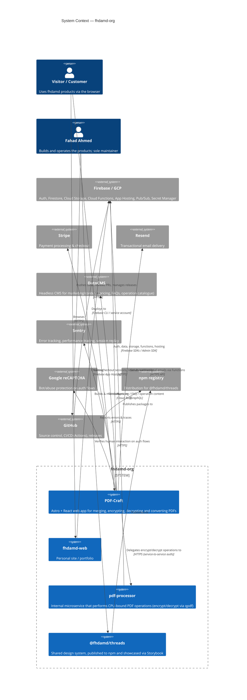

# FHDAMD-ORG — Solution Architecture

**Organisation:** fhdamd \
**Repository:** fhdamd-org (Monorepo) \
**Author:** Fahad Ahmed \
**Status:** Draft \
**Last Updated:** 19 Jun 2026

## 1. Purpose & Scope

This document describes the architecture of the `fhdamd-org` monorepo at the **organisational level**: why it exists, what it contains, how the pieces relate to one another, and the platform-wide decisions that apply across every product in it.

It is intentionally high-level. Product-specific architecture (system context, data flows, sequence diagrams, security model, deployment) is documented separately — see [PDF-Craft Solution Architecture Document](sad-pdfcraft.md) for the most mature example. As other products grow, they should gain their own SAD following the same template, and this document should link to them rather than absorb their detail.

## 2. Why a Monorepo

`fhdamd-org` is a personal monorepo that hosts every product, service, and shared package fhdamd builds, managed as a single [pnpm workspace](https://pnpm.io/workspaces) with [Turborepo](https://turborepo.com) as the task runner.

Rationale:

- **Shared design system and tooling** — `@fhdamd/threads` (the design system), ESLint/Prettier configs, and TypeScript settings are consumed by every app via workspace references (`workspace:*`), so improvements land everywhere at once without version-bump churn.
- **Consistent developer experience** — one install, one set of conventions (Conventional Commits, linting, formatting), one CI/CD posture, regardless of which product you're working in.
- **Atomic cross-cutting changes** — a change to the design system and the apps that consume it can be made and reviewed in a single PR.
- **Independent release cadence per package** — [Release Please](https://github.com/googleapis/release-please) versions and tags packages independently (e.g. `@fhdamd/threads` is published to npm on its own schedule), so the shared history doesn't force lockstep releases.

Turborepo provides the caching and task orchestration (`build`, `lint`, `check-types`, `dev`, `format`) that make this practical at the current scale, with the `^build` dependency graph ensuring packages build before the apps that depend on them.

## 3. Workspace Layout

```
apps/
  pdf-craft/        Astro + React web app for PDF creation & manipulation (Firebase App Hosting)
  fhdamd-web/       Personal site (Astro + React, Firebase App Hosting)
  pdf-processor/    Express microservice for server-side PDF processing (Cloud Run)

packages/
  threads/          @fhdamd/threads — React + CSS Modules design system (published to npm)

tooling/
  eslint/           Shared ESLint config
  prettier/         Shared Prettier config
```

| Component | Type | Stack | Hosting | Status |
|---|---|---|---|---|
| **pdf-craft** | Product (web app) | Astro + React, Firebase | Firebase App Hosting (Cloud Run) | Active — see [sad-pdfcraft.md](sad-pdfcraft.md) |
| **fhdamd-web** | Product (personal site) | Astro + React | Firebase App Hosting (Cloud Run) | Active |
| **pdf-processor** | Internal service | Express + qpdf (Cloud Run) | Cloud Run | Active — supports pdf-craft |
| **threads** | Shared package | React + CSS Modules | npm registry / Storybook on Firebase Hosting | Active — published, versioned independently |

## 4. C4 — System Context

The diagram below shows the organisation's products as a set of systems and the external parties they interact with. Each box is expanded into its own Container diagram within its product's SAD.



> **Note on scope**: `pdf-processor` is drawn as a system in its own right because it's an independently deployable Cloud Run service — but it exists solely to serve `pdf-craft` and has no other consumers today.

## 5. Shared Platform Decisions

These apply across every product in the monorepo unless a product's own SAD explicitly overrides them:

- **Firebase / GCP as the default platform** — Auth, Firestore, Cloud Storage, Cloud Functions (2nd gen), App Hosting, Pub/Sub, and Secret Manager are the default building blocks for any new product. This minimises the number of platforms to operate and secure.
- **Astro as the default web framework** — server-rendered by default (`output: 'server'`), with React islands for interactive UI, and the Node/App-Hosting adapter (`@apphosting/astro-adapter`) for deployment to Cloud Run.
- **`@fhdamd/threads` as the canonical design system** — new UI should be built from `@fhdamd/threads` components rather than bespoke styling, keeping visual language and accessibility behaviour consistent across products.
- **Sentry for observability** — error tracking, tracing, and session replay are standardised on Sentry across both the Astro frontends and Firebase Functions, with environment separation driven by an explicit `PUBLIC_APP_ENV` variable (`dev` / `stg` / `prod`) rather than inferred from hostname or `NODE_ENV`.
- **Conventional Commits + Release Please** — every commit follows [Conventional Commits](https://www.conventionalcommits.org/) (`pnpm commit`); package-scoped commits (e.g. `feat(threads):`) drive automatic versioning and changelog generation for that package.
- **Secrets via Google Secret Manager** — environment-specific configuration (API keys, DSNs, service URLs) is referenced from `apphosting.yaml` / Functions config as named secrets rather than committed to the repo. Local development uses `.env.local` files (gitignored).

## 6. Environments

Three environments per product — **DEV**, **STG**, and **PRD** — mapped to separate Firebase projects, so that staging and production behave identically (*Monorepo Parity*, see [§7](#7-architectural-principles)).

| Environment | Purpose | Status |
|---|---|---|
| **DEV** | Local development & the `*-dev` Firebase project; continuous deployment from `main` | **Active** (`deploy-dev.yml`, `pdf-craft-dev` project) |
| **STG** | Pre-production verification against production-like config; gates promotion to PRD behind an E2E suite | **Active** (`pdf-craft-stg` project, `stg.pdf-craft.app`) |
| **PRD** | Live, customer-facing; requires manual approval and a verified staging E2E pass before any deploy | **Active** (`pdf-craft-prd` project, `pdf-craft.app`) |

All three are provisioned by a single reusable Terraform module (`terraform/modules/firebase-env`), one per-project environment directory (`terraform/environments/{dev,staging,prod}`), and a per-environment GitHub Actions deploy identity via Workload Identity Federation — no long-lived service account keys stored anywhere. See [sad-pdfcraft.md §11](sad-pdfcraft.md#11-deployment-plan) for the full provisioning detail, the IAM gaps discovered standing this up, and the RC → staging → E2E gate → prod promotion pipeline (currently PDF-Craft–specific; the pattern generalises to any future product that needs the same three-tier setup).

## 7. Architectural Principles

These principles guide design decisions across every product:

- **Serverless first** — prefer managed, auto-scaling compute (Cloud Run, Cloud Functions, App Hosting) over self-managed infrastructure. `runConfig.minInstances: 0` is the default posture; pay only for what's used.
- **Security by default** — zero-trust access between services, signed URLs for time-boxed file access, least-privilege IAM, and secrets never committed to source control.
- **Monorepo parity** — DEV, STG, and PRD should run the same code paths and configuration shape (differing only in secret values), so that what's verified in staging is what ships to production.
- **Cost-aware design** — scale-to-zero by default, retention/cleanup jobs for ephemeral data (e.g. PDF-Craft's hourly expired-file cleanup), and batching/limits on background work.

## 8. Known Gaps / Forward-Looking Items

Documenting these honestly here so the record stays accurate as they're addressed:

- **Storage rules deny all access by design**, relying entirely on signed download tokens for file access rather than expiring, time-boxed URLs — flagged in detail in the [PDF-Craft SAD §9.5](sad-pdfcraft.md#95-known-gaps-flagged-honestly-for-future-hardening). (Firestore rules, previously flagged here as overly permissive, are now scoped per-user and resolved.)
- **E2E coverage is narrow** — the Playwright suite gating PRD promotion covers auth redirects, dashboard load, and one operation (encrypt); payment flows, sign-up, and the other PDF operations aren't yet covered. See [PDF-Craft SAD §9.5](sad-pdfcraft.md#95-known-gaps-flagged-honestly-for-future-hardening).
- **Per-product SADs** — `fhdamd-web`, `pdf-processor`, and `@fhdamd/threads` do not yet have their own architecture documents. As they grow in complexity, they should follow the template established by [sad-pdfcraft.md](sad-pdfcraft.md).
- **The RC/E2E/promotion pipeline is PDF-Craft–specific today** — if/when another product needs a STG/PRD split, the Terraform module and workflow shape generalise directly, but the workflows themselves (`deploy-staging.yml`, `deploy-prod.yml`, etc.) would need to be duplicated/parameterised rather than reused as-is.

## Appendix

- [PDF-Craft Solution Architecture Document](sad-pdfcraft.md)
- [Root README](../README.md) — workspace layout, getting started, tooling reference
- [How to update environment variables and secrets in Google Secrets Manager](sad-pdfcraft.md#appendix)
